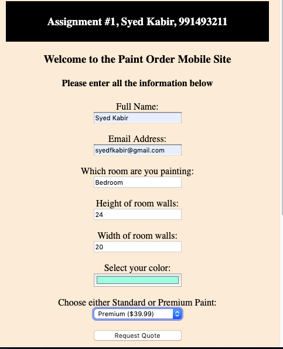
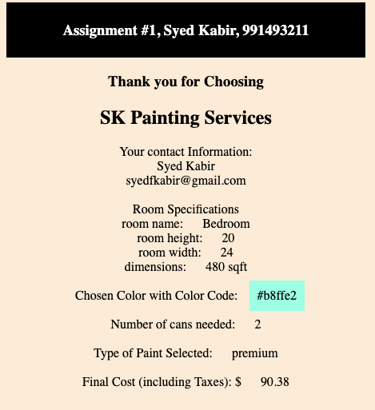
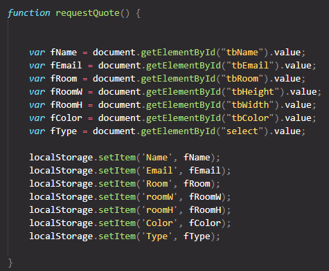
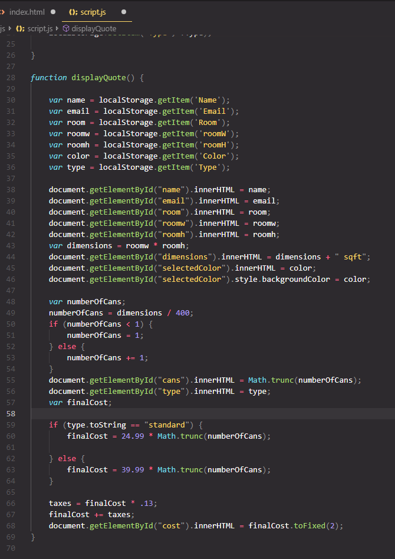

  A Simple Mobile Application

Major Takeaways:
- Local Storage
- Clean Code Structure

This mobile application was originally created for a school project, 
where I had to use local storage to store data from one html document, to another. 

This is what it looks like when its running: 

  
   
  
   
   
   
  After clicking Request Quote and getting redirected to the next page:
  
   

The part of the code that is interesting is the js script.
It uses local storage to transfer data from one page to another. 
This is only one method, as there are a few more.
- note how no logic or calculations were made in html code 
- notice that inner html tags updated on form load to implement changes 
- note that request quote first sets items in local storage 
- display quote then gets it out of local storage

  
   
  
   

