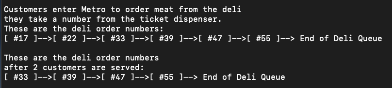
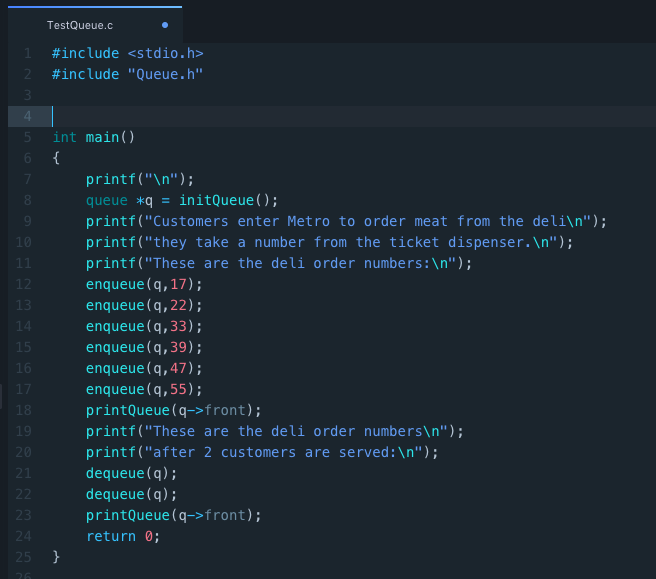
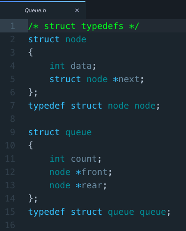
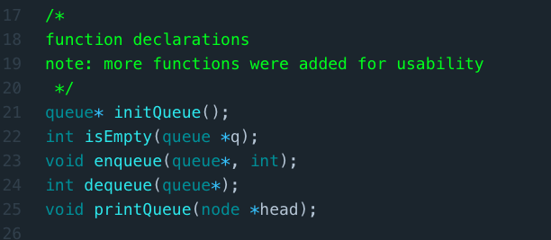
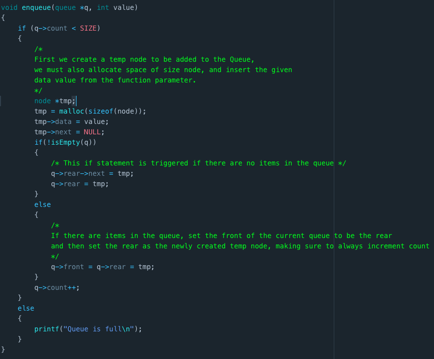
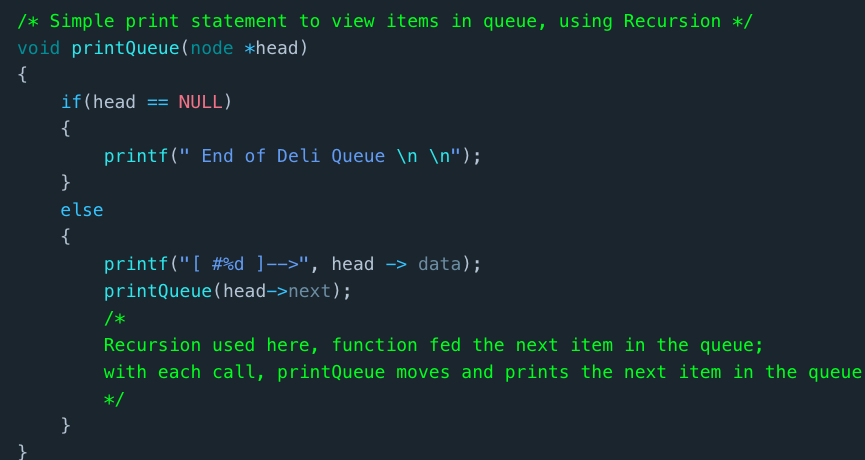

  Queues

Here is a Queue Implementation I did, some of the things I implemented were:
  - Makefile 
  - Recursion 
  - Linked List ADT 
  - Queue ADT

This is the final output of the code:

  

The main function, in TestQueue.c has this background:
 
/*
    This set of code emulates the way a line would work at a local supermarket.
    I used the example of customers entering a Metro to buy meat at the Deli.
    Customers at delis usually pull a ticket from a ticket dispenser, and wait for
    their "number to be called". This can be simulated using a queue, as it a ADT that mimics
    real life first come first served "lines". The code also shows how a queue would look if
    certain customers were already served their orders.
*/
 

  

Here are the function declarations and stucture declarations:
- notice that Queue implementation was done using Linked Lists
- LL implementation means the queue can be dynamic in size 
- self referential structures

  

  

Here are some noteworthy functions:
- Enqueue contains the bulk of the coding logic 
- Recursion used in Print Queue function 
- Comments in the screenshots explain logic

  

  

  
  
