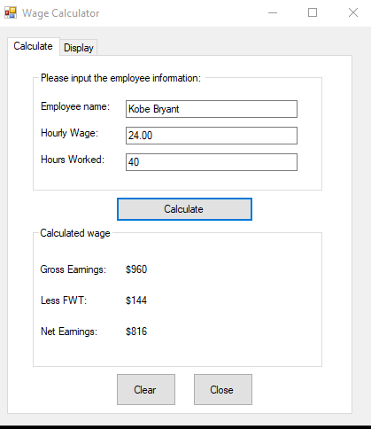
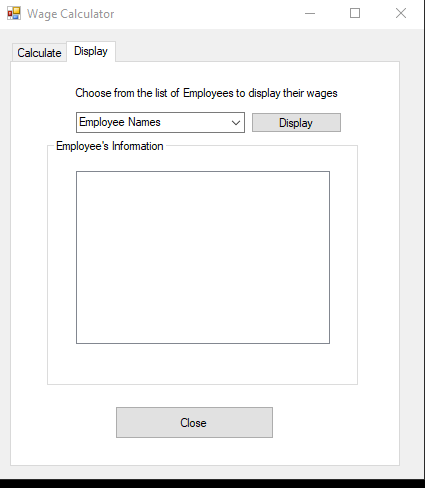
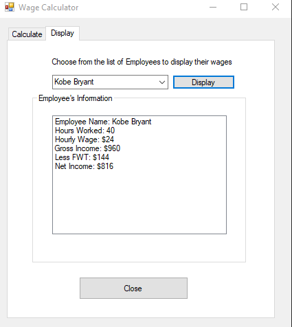

  C# Windows Forms

Major Takeaways:
- persistence through switching tabs (Input/Display Tabs)
- functional clear button, data remains in storage 
- close buttons trigger an confirmation message box
- strings stored in resources.resx
 
This is what the code looks like when its run:
First, there is a tab for you to enter employee data, it then returns calculations based off them

  

 
The other tab holds information regarding all employees, 
dummy data was included as an example

  

 
This was the employee info that was entered in the previous tab, 

  

 
